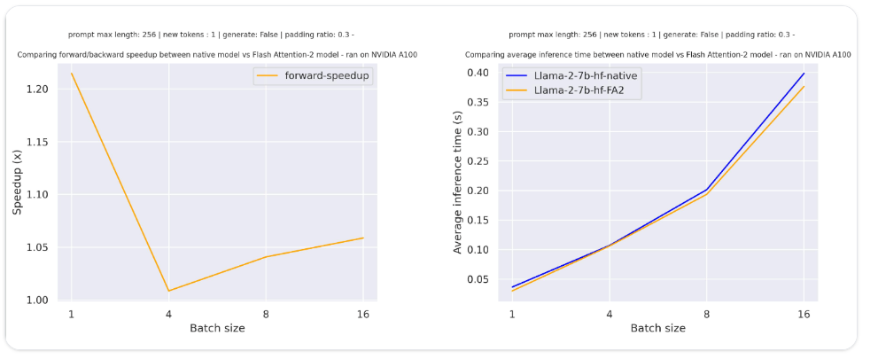
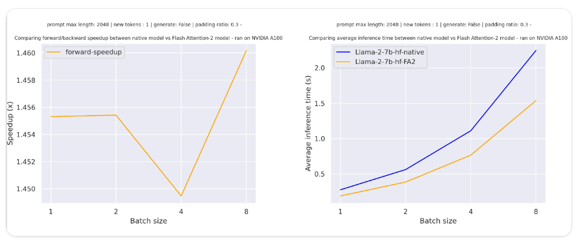
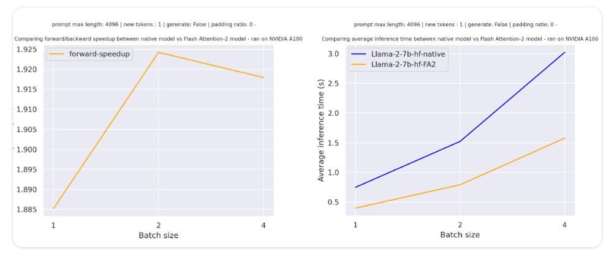

# Performance_and_scalability

### Optimizing inference

Use a GPU, and optimize inference with:

- Flash-attention :

FlashAttention-2 is a faster and more efficient implementation of the standard attention mechanism that can significantly speedup inference and transform its complexity from quadratic to linear.

On Nvidia, we have to install flash attention:
```pip install flash-attn --no-build-isolation```

Then to use the flash attention algo, we have to pass the argument ```attn_implementation="flash_attention_2"``` to from_pretrained():
```
import torch
from transformers import AutoModelForCausalLM, AutoTokenizer, LlamaForCausalLM

model_id = "tiiuae/falcon-7b"
tokenizer = AutoTokenizer.from_pretrained(model_id)

model = AutoModelForCausalLM.from_pretrained(
    model_id,
    torch_dtype=torch.bfloat16,
    attn_implementation="flash_attention_2",
)
```

FlashAttention-2 can only be used when the model’s dtype is fp16 or bf16.

FlashAttention-2 can be combined with other optimization techniques like quantization (with 8-bit or 4-bit) to further speedup inference.

FlashAttention-2 does not support computing attention scores with padding tokens. To overcome this, you should use FlashAttention-2 without padding tokens in the sequence during training (by packing a dataset or concatenating sequences until reaching the maximum sequence length).

The larger sequence lengths you have , the more speedups you get.

For example, with a relatively small sequence length (prompt_max_kength=256),  and a padding ratio of 0.3 (30% of the input is filled with padding tokens) a single forward pass creates overhead leading to a small speedup


But for larger sequence lengths (prompt_max_kength=2048 and keeping a padding ratio of 0.3 ), you can expect even more speedup benefits. Besides, FlashAttention is more memory efficient, meaning you can train on much larger sequence lengths without running into out-of-memory issues.


And if Flash attention is well  used with large sequences and without padding, we can have more speedup benefits (up to *2). check-out the speeedups here on the same model for larger sequence lengths (prompt_max_kength=4096) and  a padding ratio of 0.



- PyTorch scaled dot product attention :

 SDPA support is currently being added natively in Transformers and is used by default for torch>=2.1.1 when an implementation is available. You may also set ```attn_implementation="sdpa"``` in from_pretrained() to explicitly request SDPA to be used

 
- BetterTransformer :

Some BetterTransformer features are being upstreamed to Transformers with default support for native SDPA; BetterTransformer still has a wider coverage than the Transformers SDPA integration, but you can expect more and more architectures to natively support SDPA in Transformers.

BetterTransformer accelerates inference with its fastpath (native PyTorch specialized implementation of Transformer functions) execution.

BetterTransformer two optimizations in the fastpath execution (fusion and skipping the inherent sparsity of padding tokens). It also converts all attention operations to use the more memory-efficient scaled dot product attention (SDPA), and it calls optimized kernels like FlashAttention under the hood.

Make sure you have 🤗 Optimum installed. Then you can enable BetterTransformer with :
```model = model.to_bettertransformer()```


- Quantization with bitsandbytes :

Quantization reduces your model size compared to its native full precision version, making it easier to fit large models onto GPUs with limited memory.  It supports 4-bit and 8-bit quantization.

If you’re loading a model in 8-bit for text generation, you should use the generate() method instead of the Pipeline function which is not optimized for 8-bit models and will be slower. You should also place all inputs on the same device as the model.

- Combine optimizations :

It is often possible to combine several of the optimization techniques.  For example, you can load a model in 4-bit, and then enable BetterTransformer with FlashAttention:

```
import torch
from transformers import AutoModelForCausalLM, AutoTokenizer, BitsAndBytesConfig

# load model in 4-bit
quantization_config = BitsAndBytesConfig(
    load_in_4bit=True,
    bnb_4bit_compute_dtype=torch.float16
)

tokenizer = AutoTokenizer.from_pretrained("facebook/opt-350m")
model = AutoModelForCausalLM.from_pretrained("facebook/opt-350m", quantization_config=quantization_config)

# enable BetterTransformer
model = model.to_bettertransformer()

input_text = "Hello my dog is cute and"
inputs = tokenizer(input_text, return_tensors="pt").to("cuda")

# enable FlashAttention
with torch.backends.cuda.sdp_kernel(enable_flash=True, enable_math=False, enable_mem_efficient=False):
    outputs = model.generate(**inputs)

print(tokenizer.decode(outputs[0], skip_special_tokens=True))
```

### LLM inference optimization

##### Key Components in the GPU for LLM Inference
- GPU Global Memory (VRAM):
This is where the entire model’s parameters (weights) and input data are stored.
In the case of LLMs, these parameters are large matrices that need to be accessed repeatedly during inference.

- Local Caches:
To avoid fetching data from the main VRAM constantly (which is relatively slow), GPUs have cache memory, such as L1 and L2 caches, which are closer to the computation units.
Caches store copies of frequently used data, reducing the need to go back to VRAM every time the data is needed.

- Registers:
Registers are the smallest, fastest type of memory and are located directly on the computation units (i.e., the cores of the GPU).
These hold data for immediate operations (like matrix multiplication). Registers are extremely fast to access, so data needs to be in registers to get processed at maximum speed.

- Computation Units (GPU Cores):
These are the parts of the GPU that actually perform calculations. In NVIDIA GPUs, they’re often called CUDA cores or Tensor cores (specialized for matrix operations).
For LLM inference, these units handle matrix-matrix multiplications, which are essential for generating tokens in autoregressive models.

##### The Data Movement Process

- Fetching Data from VRAM to Caches:
During LLM inference, parameters (model weights) must be loaded from VRAM into local caches. Since LLMs use vast numbers of parameters, this step can be slow if memory bandwidth is low because many parameters need to be moved quickly to keep up with computation demands.
Memory bandwidth (the rate of data transfer) here is crucial because it dictates how fast data can move from VRAM to caches.

- Moving Data from Caches to Registers:
Once data is in the cache, it’s moved to the computation units via registers. Registers store data temporarily while it’s actively being used in computations.
This step is much faster than moving data from VRAM, but cache misses (if required data isn’t in the cache and has to go back to VRAM) can still slow things down.

- Executing Computations in the Cores:
Once the required data is in the registers, the GPU cores perform the actual calculations. If data is available in the registers, computations proceed at the maximum speed.
However, if the data needed for computations isn’t ready in the registers or cache (due to slow movement from VRAM), the computation units have to wait, which slows down the overall inference speed.

##### Why Memory Bandwidth is Crucial in LLM Inference

For autoregressive token generation, each token needs to be computed in sequence, so if the GPU cores are waiting on data to come from VRAM, it creates a bottleneck. This is why memory bandwidth (how quickly data can move from VRAM to registers) is more crucial than raw compute power—it ensures data is available as soon as it’s needed by the computation units.
In short, the process involves fetching parameters from VRAM, temporarily storing them in local caches, transferring them to registers, and then finally using them in the GPU cores for computation.

If batch size is small, matrix computation would be easy and fast and the bottleneck would be data transfer to computation units. Available and achieved memory bandwidth in inference hardware is a better predictor of speed of token generation than their peak compute performance.

In the databricks (llm inference best practices blog)[https://www.databricks.com/blog/llm-inference-performance-engineering-best-practices] a new metric called Model Bandwidth Utilization (MBU) is defined as (achieved memory bandwidth) / (peak memory bandwidth) where achieved memory bandwidth is ((total model parameter size + KV cache size) / TPOT). MBU is complementary to the Model Flops Utilization (MFU; introduced in the PaLM paper) metric which is important in compute-bound settings.

For example, if a 7B parameter running with 16-bit precision has TPOT equal to 14ms, then it's moving 14GB of parameters in 14ms translating to 1TB/sec bandwidth usage. If the peak bandwidth of the machine is 2TB/sec, we are running at an MBU of 50%.

##### LLM Inference servers

There are multiple PyTorch-based backends in production like FasterTransformers, vLLM, NVIDIA's TensorRT-LLM, TGI and others.

##### LLM Inference metrics

Large Language Models (LLMs) generate text in a two-step process: "prefill", where the tokens in the input prompt are processed in parallel, and "decoding", where text is generated one 'token' at a time in an autoregressive manner till the LLM outputs a special stop token.

There are 4 key metrics to think about inference speed:
- Time To First Token (TTFT): How quickly users start seeing the model's output after entering their query. This metric is driven by the time required to process the prompt and then generate the first output token.
- Time Per Output Token (TPOT): Time to generate an output token for each user that is querying our system.
- Latency: The overall time it takes for the model to generate the full response for a user. Overall response latency can be calculated using the previous two metrics: latency = (TTFT) + (TPOT) * (the number of tokens to be generated).
- Throughput: The number of output tokens per second an inference server can generate across all users and requests.

Notably, there is a tradeoff between throughput and time per output token: if we process 16 user queries concurrently, we'll have higher throughput compared to running the queries sequentially, but we'll take longer to generate output tokens for each user.

The input and output length impacts directly the performances. Additional input length may not increase so much the latency but requires more capable hardware. the expected output length gives you an idea of the expected latency.

##### LLM Inference optimization techniques

Several techniques are available to optimize LLM inference : 
- Operator Fusion: Combining different adjacent operators together often results in better latency.
- Quantization: Activations and weights are compressed to use a smaller number of bits. it is important to remember that model quantization trades improved memory efficiency against accuracy and in some cases inference time.
- Compression: Sparsity or Distillation.
- Parallelization: Tensor parallelism across multiple devices or pipeline parallelism for larger models.
- KV (key-value) caching : Each token attends to all previously seen tokens, and thus recomputes many of the same values as each new token is generated. For example, while generating the Nth token, the (N-1)th token attends to (N-2)th, (N-3)th … 1st tokens. Similarly, while generating (N+1)th token, attention for the Nth token again needs to look at the (N-1)th, (N-2)th, (N-3)th, … 1st tokens. KV caching, i.e., saving of intermediate keys/values for the attention layers, is used to preserve those results for later reuse, avoiding repeated computation.


